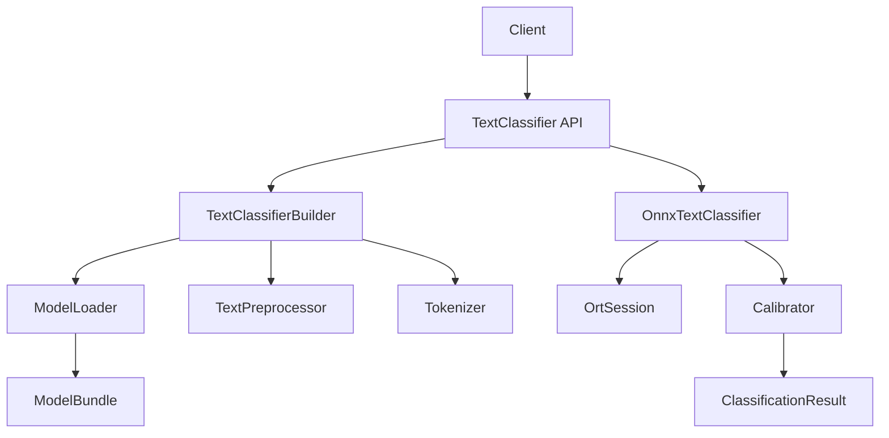

# Java ONNX NLP Library - Improvements Roadmap

**Version:** 0.1.0-SNAPSHOT
**Last Updated:** 2025-11-17
**Status:** Comprehensive Review Complete

## Executive Summary

This roadmap outlines strategic improvements for the Java ONNX NLP library across four key areas: **Developer Experience**, **Testing**, **Security**, and **Performance**. The codebase demonstrates solid architectural foundations with clean separation of concerns, but opportunities exist to enhance production readiness, developer productivity, and operational reliability.

### Current State
- **Code Quality:** Well-architected with clean API/implementation separation
- **Test Coverage:** Limited (3 test classes for 28 Java files)
- **Documentation:** Good high-level docs, missing API documentation generation
- **Production Readiness:** 70% - needs security hardening and observability

### Priority Distribution
- 🔴 **Critical (P0):** Security fixes, essential testing
- 🟡 **High (P1):** Developer experience, production features
- 🟢 **Medium (P2):** Performance optimization, polish
- 🔵 **Low (P3):** Nice-to-have enhancements

---

## 1. Developer Experience Improvements

### 1.1 Build & Dependency Management

#### 🟡 P1: Implement Gradle Version Catalog
**Impact:** Centralized dependency management, easier version updates
**Effort:** 2-4 hours

**Current Issue:**
- Dependencies scattered across multiple `build.gradle.kts` files
- Version numbers hardcoded (e.g., `1.18.32`, `5.10.2`)
- Difficult to maintain version consistency

**Implementation:**
```kotlin
// gradle/libs.versions.toml
[versions]
onnxruntime = "1.17.1"
jackson = "2.17.0"
spring-boot = "3.2.3"
junit = "5.10.2"

[libraries]
onnxruntime = { module = "com.microsoft.onnxruntime:onnxruntime", version.ref = "onnxruntime" }
jackson-databind = { module = "com.fasterxml.jackson.core:jackson-databind", version.ref = "jackson" }
# ... etc

[bundles]
testing = ["junit-jupiter", "assertj-core", "mockito-core"]
```

**Files to modify:**
- Create `gradle/libs.versions.toml`
- Update `build.gradle.kts`, `nlp-onnx-core/build.gradle.kts`, `nlp-onnx-spring-boot-starter/build.gradle.kts`

**Acceptance Criteria:**
- [ ] All versions centralized in version catalog
- [ ] All modules use catalog references
- [ ] Build succeeds with no dependency warnings

---

#### 🟡 P1: Generate JavaDoc HTML
**Impact:** API documentation for consumers
**Effort:** 1-2 hours

**Current Issue:**
- JavaDoc comments exist but no HTML generation configured
- External developers cannot browse API documentation

**Implementation:**
```kotlin
// build.gradle.kts
subprojects {
    tasks.withType<Javadoc> {
        options {
            (this as StandardJavadocDocletOptions).apply {
                addStringOption("Xdoclint:none", "-quiet")
                addBooleanOption("html5", true)
                links("https://docs.oracle.com/en/java/javase/21/docs/api/")
            }
        }
    }

    tasks.register<Jar>("javadocJar") {
        from(tasks.javadoc)
        archiveClassifier.set("javadoc")
    }
}
```

**Deliverables:**
- JavaDoc HTML in `build/docs/javadoc/`
- GitHub Pages deployment option
- Javadoc JAR artifacts for Maven publishing

**Acceptance Criteria:**
- [ ] `./gradlew javadoc` generates HTML for all modules
- [ ] All public APIs documented with examples
- [ ] Links to Java 21 standard library work

---

#### 🟡 P1: Add Continuous Integration
**Impact:** Automated testing, quality gates
**Effort:** 2-3 hours

**Current Issue:**
- No CI/CD pipeline visible
- Manual testing burden on developers
- No automated quality checks

**Implementation:**
Create `.github/workflows/ci.yml`:

```yaml
name: CI

on: [push, pull_request]

jobs:
  build:
    runs-on: ubuntu-latest
    strategy:
      matrix:
        java: [21, 22]

    steps:
      - uses: actions/checkout@v4
      - uses: actions/setup-java@v4
        with:
          distribution: 'temurin'
          java-version: ${{ matrix.java }}
          cache: 'gradle'

      - name: Build with Gradle
        run: ./gradlew build

      - name: Run tests
        run: ./gradlew test

      - name: Upload test results
        if: failure()
        uses: actions/upload-artifact@v4
        with:
          name: test-results
          path: '**/build/test-results/'

      - name: Generate code coverage
        run: ./gradlew jacocoTestReport

      - name: Upload coverage to Codecov
        uses: codecov/codecov-action@v4
```

**Acceptance Criteria:**
- [ ] CI runs on every push/PR
- [ ] Tests must pass before merge
- [ ] Coverage report uploaded to Codecov
- [ ] Build status badge in README

---

#### 🟢 P2: Dependency Vulnerability Scanning
**Impact:** Security, supply chain risk reduction
**Effort:** 1-2 hours

**Implementation:**
```kotlin
// build.gradle.kts
plugins {
    id("org.owasp.dependencycheck") version "9.0.9" apply false
}

subprojects {
    apply(plugin = "org.owasp.dependencycheck")

    dependencyCheck {
        failBuildOnCVSS = 7.0f
        suppressionFile = file("$rootDir/config/dependency-check-suppressions.xml")
    }
}
```

Add to CI:
```yaml
- name: Dependency Check
  run: ./gradlew dependencyCheckAggregate
```

**Acceptance Criteria:**
- [ ] Weekly dependency vulnerability scans
- [ ] Build fails on high-severity CVEs
- [ ] Suppression mechanism for false positives

---

#### 🟢 P2: Code Style & Formatting
**Impact:** Code consistency, reduced PR review time
**Effort:** 2-3 hours

**Implementation:**
1. Add Spotless plugin:
```kotlin
plugins {
    id("com.diffplug.spotless") version "6.25.0" apply false
}

subprojects {
    apply(plugin = "com.diffplug.spotless")

    spotless {
        java {
            googleJavaFormat("1.19.2")
            removeUnusedImports()
            trimTrailingWhitespace()
            endWithNewline()
        }
    }
}
```

2. Add Checkstyle:
```kotlin
checkstyle {
    toolVersion = "10.14.0"
    configFile = file("$rootDir/config/checkstyle/checkstyle.xml")
}
```

**Deliverables:**
- `config/checkstyle/checkstyle.xml` (Google Style)
- Pre-commit hook script
- CI enforcement

**Acceptance Criteria:**
- [ ] `./gradlew spotlessCheck` validates formatting
- [ ] `./gradlew spotlessApply` auto-fixes violations
- [ ] CI fails on formatting issues

---

#### 🟢 P2: Enhanced Logging Configuration
**Impact:** Better debugging, production troubleshooting
**Effort:** 1-2 hours

**Current Issue:**
- SLF4J API present but no implementation in dependencies
- Users must configure logging themselves
- No structured logging support

**Implementation:**
1. Add optional Logback dependency:
```kotlin
// nlp-onnx-core/build.gradle.kts
dependencies {
    testImplementation("ch.qos.logback:logback-classic:1.5.3")
}
```

2. Create example `logback.xml`:
```xml
<!-- src/test/resources/logback.xml -->
<configuration>
    <appender name="STDOUT" class="ch.qos.logback.core.ConsoleAppender">
        <encoder>
            <pattern>%d{HH:mm:ss.SSS} [%thread] %-5level %logger{36} - %msg%n</pattern>
        </encoder>
    </appender>

    <logger name="uk.codery.onnx.nlp" level="DEBUG"/>
    <logger name="ai.onnxruntime" level="INFO"/>

    <root level="INFO">
        <appender-ref ref="STDOUT"/>
    </root>
</configuration>
```

3. Add structured logging utility:
```java
public class MetricsLogger {
    public void logInference(String modelName, int batchSize, long durationMs) {
        log.info("inference: model={} batch_size={} duration_ms={}",
                 modelName, batchSize, durationMs);
    }
}
```

**Acceptance Criteria:**
- [ ] Example logging configurations in docs
- [ ] Structured log format for metrics
- [ ] MDC support for request tracing

---

### 1.2 Development Tooling

#### 🟢 P2: IntelliJ IDEA Configuration
**Impact:** Consistent IDE setup across team
**Effort:** 1 hour

**Deliverables:**
- `.idea/codeStyles/Project.xml` - Code style settings
- `.idea/inspectionProfiles/Project_Default.xml` - Inspection profile
- `.editorconfig` - Language-agnostic style rules

**Implementation:**
```properties
# .editorconfig
root = true

[*]
charset = utf-8
end_of_line = lf
insert_final_newline = true
trim_trailing_whitespace = true

[*.java]
indent_style = space
indent_size = 4
max_line_length = 120

[*.{gradle.kts,kt}]
indent_style = space
indent_size = 4
```

---

#### 🔵 P3: Developer Onboarding Script
**Impact:** Faster new developer setup
**Effort:** 2 hours

**Implementation:**
```bash
#!/bin/bash
# scripts/setup-dev.sh

echo "Setting up Java ONNX NLP development environment..."

# Check Java version
if ! java -version 2>&1 | grep -q "version \"21"; then
    echo "Error: Java 21 required"
    exit 1
fi

# Build project
./gradlew clean build

# Download sample models
if [ ! -d "scripts/models" ]; then
    echo "No models found. Train sample models? (y/n)"
    read -r response
    if [ "$response" = "y" ]; then
        cd scripts && source .venv/bin/activate
        uv run onnx_train.py --output models/sample
    fi
fi

echo "Setup complete! Run: ./gradlew test"
```

---

### 1.3 Documentation Enhancements

#### 🟡 P1: Architecture Diagrams
**Impact:** Faster onboarding, clearer design communication
**Effort:** 3-4 hours

**Deliverables:**
1. **Component Architecture** (using Mermaid):
```markdown
## docs/ARCHITECTURE.md


```

2. **Inference Pipeline Flow**
3. **Spring Boot Integration Lifecycle**
4. **Model Bundle Structure**

**Acceptance Criteria:**
- [ ] Diagrams in `docs/ARCHITECTURE.md`
- [ ] Mermaid diagrams render on GitHub
- [ ] Referenced from README.md

---

#### 🟢 P2: Troubleshooting Guide
**Impact:** Reduced support burden, better user experience
**Effort:** 2-3 hours

**Implementation:**
Create `docs/TROUBLESHOOTING.md`:

```markdown
# Troubleshooting Guide

## Model Loading Issues

### Error: "Model file not found"
**Cause:** Incorrect model path
**Solution:**
- Verify path exists: `ls -la /path/to/model`
- Check directory structure has `model.onnx`, `config.json`

### Error: "OrtException: Invalid model"
**Cause:** Corrupted or incompatible ONNX model
**Solution:**
- Validate model: `python -c "import onnx; onnx.checker.check_model('model.onnx')"`
- Re-export model with compatible ONNX opset

## Inference Errors

### Error: "Tokenizer is required but was not provided"
**Cause:** Token-based model without tokenizer
**Solution:** Add tokenizer in builder or provide vocabulary in config

[... more scenarios ...]
```

---

## 2. Testing Improvements

### 2.1 Test Coverage

#### 🔴 P0: Add JaCoCo Code Coverage
**Impact:** Visibility into untested code
**Effort:** 1 hour

**Current State:**
- No coverage metrics tracked
- Unknown test coverage percentage

**Implementation:**
```kotlin
// build.gradle.kts
plugins {
    id("jacoco") apply false
}

subprojects {
    apply(plugin = "jacoco")

    jacoco {
        toolVersion = "0.8.11"
    }

    tasks.test {
        finalizedBy(tasks.jacocoTestReport)
    }

    tasks.jacocoTestReport {
        dependsOn(tasks.test)
        reports {
            xml.required.set(true)
            html.required.set(true)
        }
    }

    tasks.jacocoTestCoverageVerification {
        violationRules {
            rule {
                limit {
                    minimum = "0.70".toBigDecimal()
                }
            }
        }
    }
}
```

**Acceptance Criteria:**
- [ ] Coverage report generated on every test run
- [ ] Minimum 70% line coverage enforced
- [ ] HTML report accessible in `build/reports/jacoco/`

---

#### 🔴 P0: Unit Tests for Core Classes
**Impact:** Catch regressions, faster feedback
**Effort:** 8-12 hours

**Current Gap:**
Only 3 test classes exist. Missing tests for:
- `OnnxTextClassifier` (only integration tests exist)
- `FileSystemModelLoader`
- `TextClassifierBuilder`
- `SimpleWhitespaceTokenizer`
- `PlattCalibrator`, `IdentityCalibrator`
- `CalibratorFactory`

**Implementation Plan:**

**File:** `OnnxTextClassifierTest.java`
```java
@ExtendWith(MockitoExtension.class)
class OnnxTextClassifierTest {
    @Mock OrtEnvironment mockEnv;
    @Mock OrtSession mockSession;
    @Mock Tokenizer mockTokenizer;
    @Mock TextPreprocessor mockPreprocessor;

    @Test
    void shouldDetectStringInputType() { /* ... */ }

    @Test
    void shouldHandleTokenBasedInput() { /* ... */ }

    @Test
    void shouldApplyPreprocessing() { /* ... */ }

    @Test
    void shouldApplyCalibration() { /* ... */ }

    @Test
    void shouldHandleBatchInference() { /* ... */ }

    @Test
    void shouldThrowWhenTokenizerMissing() { /* ... */ }

    @Test
    void shouldCloseResourcesOnClose() { /* ... */ }
}
```

**Priority Test Files:**
1. `OnnxTextClassifierTest` (20+ test methods)
2. `FileSystemModelLoaderTest` (10+ test methods)
3. `TextClassifierBuilderTest` (15+ test methods)
4. `SimpleWhitespaceTokenizerTest` (8+ test methods)
5. `PlattCalibratorTest` (5+ test methods)

**Acceptance Criteria:**
- [ ] All public methods have unit tests
- [ ] Edge cases tested (null inputs, empty lists, etc.)
- [ ] Exception paths tested
- [ ] Mocking used to isolate units

---

#### 🔴 P0: Error Path Testing
**Impact:** Production stability, graceful degradation
**Effort:** 4-6 hours

**Scenarios to Cover:**

1. **Model Loading Failures:**
   - Missing `model.onnx` file
   - Missing `config.json` file
   - Malformed JSON in config
   - Invalid ONNX model bytes
   - Path traversal attempts

2. **Inference Failures:**
   - OrtException during inference
   - Tensor dimension mismatch
   - Invalid tensor names
   - Out of memory conditions
   - Concurrent access edge cases

3. **Calibration Errors:**
   - Invalid calibration parameters
   - Negative/NaN probabilities
   - Non-normalized probability arrays

**Example Test:**
```java
@Test
void shouldThrowIOExceptionWhenModelFileMissing() {
    Path invalidPath = Paths.get("/nonexistent/model");
    FileSystemModelLoader loader = new FileSystemModelLoader();

    assertThatThrownBy(() -> loader.load(invalidPath))
        .isInstanceOf(IOException.class)
        .hasMessageContaining("Model file not found");
}

@Test
void shouldHandleOrtExceptionGracefully() {
    // Mock OrtException during inference
    when(mockSession.run(any())).thenThrow(new OrtException("CUDA error"));

    assertThatThrownBy(() -> classifier.classify("test"))
        .isInstanceOf(RuntimeException.class)
        .hasMessageContaining("Inference failed")
        .hasCauseInstanceOf(OrtException.class);
}
```

---

#### 🟡 P1: Spring Boot Auto-Configuration Tests
**Impact:** Ensure Spring integration works correctly
**Effort:** 3-4 hours

**Current Gap:**
No tests for `NlpOnnxAutoConfiguration` or `NlpOnnxProperties`

**Implementation:**
```java
@SpringBootTest
@TestPropertySource(properties = {
    "nlp.onnx.enabled=true",
    "nlp.onnx.model-path=/tmp/test-model",
    "nlp.onnx.warmup=true",
    "nlp.onnx.warmup-texts=sample text"
})
class NlpOnnxAutoConfigurationTest {

    @Autowired(required = false)
    private TextClassifier textClassifier;

    @Autowired
    private OrtEnvironment ortEnvironment;

    @Test
    void shouldAutoConfigureTextClassifier() {
        assertThat(textClassifier).isNotNull();
    }

    @Test
    void shouldCreateSharedOrtEnvironment() {
        assertThat(ortEnvironment).isNotNull();
    }

    @Test
    void shouldRespectEnabledProperty() {
        // Test with enabled=false
    }

    @Test
    void shouldAllowCustomBeanOverride() {
        // Test @ConditionalOnMissingBean
    }
}
```

**Test Scenarios:**
- [ ] Beans created when properties set
- [ ] Beans not created when disabled
- [ ] Custom bean overrides work
- [ ] Warmup executes on startup
- [ ] Preprocessing config applied correctly

---

#### 🟢 P2: Performance & Load Tests
**Impact:** Understand throughput limits, identify bottlenecks
**Effort:** 4-6 hours

**Implementation:**
Create `PerformanceTest.java`:

```java
@Tag("performance")
class PerformanceTest {

    private TextClassifier classifier;

    @BeforeEach
    void setup() throws Exception {
        // Load real model
    }

    @Test
    void shouldHandleHighThroughput() {
        int numRequests = 10_000;
        List<String> texts = generateRandomTexts(numRequests);

        long start = System.currentTimeMillis();
        texts.forEach(classifier::classify);
        long duration = System.currentTimeMillis() - start;

        double throughput = numRequests / (duration / 1000.0);
        log.info("Throughput: {} requests/sec", throughput);

        assertThat(throughput).isGreaterThan(100); // Baseline
    }

    @Test
    void shouldScaleWithBatchSize() {
        // Compare classify() vs classifyBatch()
        // Verify batch is more efficient
    }

    @Test
    @Tag("stress")
    void shouldHandleConcurrentRequests() throws InterruptedException {
        int numThreads = 10;
        int requestsPerThread = 1000;

        ExecutorService executor = Executors.newFixedThreadPool(numThreads);
        CountDownLatch latch = new CountDownLatch(numThreads);

        for (int i = 0; i < numThreads; i++) {
            executor.submit(() -> {
                try {
                    for (int j = 0; j < requestsPerThread; j++) {
                        classifier.classify("test text");
                    }
                } finally {
                    latch.countDown();
                }
            });
        }

        latch.await(60, TimeUnit.SECONDS);
        executor.shutdown();

        // Verify no errors, acceptable latency
    }
}
```

Run with: `./gradlew test --tests PerformanceTest`

**Metrics to Track:**
- Requests per second (single-threaded)
- Requests per second (multi-threaded)
- P50, P95, P99 latency
- Memory usage under load
- Batch vs single classification efficiency

---

#### 🟢 P2: Mutation Testing
**Impact:** Verify test effectiveness
**Effort:** 2-3 hours

**Implementation:**
```kotlin
plugins {
    id("info.solidsoft.pitest") version "1.15.0" apply false
}

subprojects {
    apply(plugin = "info.solidsoft.pitest")

    pitest {
        targetClasses.set(listOf("uk.codery.onnx.nlp.*"))
        targetTests.set(listOf("uk.codery.onnx.nlp.*Test"))
        outputFormats.set(listOf("HTML", "XML"))
        timestampedReports.set(false)
        mutationThreshold.set(70)
    }
}
```

Run: `./gradlew pitest`

---

### 2.2 Test Infrastructure

#### 🟢 P2: Test Data Generators
**Impact:** Easier test creation, better coverage
**Effort:** 2-3 hours

**Implementation:**
```java
public class TestDataFactory {

    public static ModelBundle createTestModelBundle() {
        return ModelBundle.builder()
            .modelBytes(createMinimalOnnxModel())
            .config(createTestModelConfig())
            .calibration(createTestCalibration())
            .build();
    }

    public static ModelConfig createTestModelConfig() {
        return ModelConfig.builder()
            .modelName("test-model")
            .version("1.0.0")
            .classLabels(List.of("class_0", "class_1"))
            .inputTensorName("input")
            .outputTensorName("output")
            .maxSequenceLength(128)
            .build();
    }

    public static List<String> generateRandomTexts(int count) {
        return IntStream.range(0, count)
            .mapToObj(i -> "Sample text " + i)
            .toList();
    }
}
```

---

## 3. Security Improvements

### 3.1 Input Validation & Sanitization

#### 🔴 P0: Regex DoS Prevention
**Impact:** Prevent denial-of-service via malicious input
**Effort:** 2-3 hours
**Risk Level:** HIGH

**Current Vulnerability:**
In `BasicTextPreprocessor.java:17-24`, regex patterns are susceptible to catastrophic backtracking (ReDoS):

```java
// VULNERABLE
private static final Pattern URL_PATTERN = Pattern.compile(
    "https?://[\\w.-]+(?:\\.[\\w.-]+)+[\\w\\-._~:/?#\\[\\]@!$&'()*+,;=]*"
);
```

**Attack Vector:**
```java
String malicious = "http://" + "a".repeat(10000) + "!" + "a".repeat(10000);
// Can cause exponential backtracking, CPU spike
```

**Fix:**
1. Add timeout to regex matching:
```java
public class SafeRegexMatcher {
    private static final Duration REGEX_TIMEOUT = Duration.ofMillis(100);

    public static String replaceAll(Pattern pattern, String input, String replacement) {
        CompletableFuture<String> future = CompletableFuture.supplyAsync(() ->
            pattern.matcher(input).replaceAll(replacement)
        );

        try {
            return future.get(REGEX_TIMEOUT.toMillis(), TimeUnit.MILLISECONDS);
        } catch (TimeoutException e) {
            log.warn("Regex timeout exceeded for input length: {}", input.length());
            return input; // Return original on timeout
        }
    }
}
```

2. Optimize regex patterns:
```java
// SAFER - possessive quantifiers, bounded repetition
private static final Pattern URL_PATTERN = Pattern.compile(
    "https?://[\\w.-]{1,256}(?:\\.[\\w.-]{1,256})+[\\w\\-._~:/?#\\[\\]@!$&'()*+,;=]{0,1024}"
);
```

3. Add input length limits:
```java
@Override
public String preprocess(@NonNull String text) {
    if (text.length() > 10_000) {
        throw new IllegalArgumentException(
            "Text too long: " + text.length() + " (max 10,000 chars)");
    }
    // ... rest of preprocessing
}
```

**Acceptance Criteria:**
- [ ] All regex patterns have bounded quantifiers
- [ ] Regex matching has timeouts
- [ ] Input length limits enforced
- [ ] Stress test with pathological inputs passes

**References:**
- OWASP: [Regular expression Denial of Service](https://owasp.org/www-community/attacks/Regular_expression_Denial_of_Service_-_ReDoS)

---

#### 🔴 P0: Path Traversal Protection
**Impact:** Prevent unauthorized file access
**Effort:** 1-2 hours
**Risk Level:** MEDIUM

**Current Vulnerability:**
In `FileSystemModelLoader.java:36`, no validation of `modelPath`:

```java
@Override
public ModelBundle load(@NonNull Path modelPath) throws IOException {
    if (!Files.isDirectory(modelPath)) {
        throw new IOException("Model path must be a directory: " + modelPath);
    }
    // VULNERABLE: No path traversal check
    byte[] modelBytes = Files.readAllBytes(modelFile);
}
```

**Attack Vector:**
```java
Path malicious = Paths.get("/safe/models/../../../etc/passwd");
// Could read sensitive files if not validated
```

**Fix:**
```java
@Override
public ModelBundle load(@NonNull Path modelPath) throws IOException {
    // Normalize and validate path
    Path normalized = modelPath.toAbsolutePath().normalize();

    // Ensure path is within allowed base directory (if configured)
    if (allowedBasePath != null && !normalized.startsWith(allowedBasePath)) {
        throw new SecurityException(
            "Model path outside allowed directory: " + normalized);
    }

    if (!Files.isDirectory(normalized)) {
        throw new IOException("Model path must be a directory: " + normalized);
    }

    // Validate symbolic links
    if (Files.isSymbolicLink(normalized)) {
        throw new SecurityException("Symbolic links not allowed: " + normalized);
    }

    // Continue with loading...
}
```

Add configuration:
```java
public FileSystemModelLoader(Path allowedBasePath) {
    this.allowedBasePath = allowedBasePath.toAbsolutePath().normalize();
    this.objectMapper = new ObjectMapper();
}
```

**Acceptance Criteria:**
- [ ] Path traversal attempts throw SecurityException
- [ ] Symbolic links blocked by default
- [ ] Allowed base path configurable
- [ ] Security tests added

---

#### 🔴 P0: ONNX Model Validation
**Impact:** Prevent malicious model execution
**Effort:** 3-4 hours
**Risk Level:** HIGH

**Current Issue:**
No validation of ONNX model content before loading into runtime. Malicious models could:
- Consume excessive memory
- Execute arbitrary operations
- Exploit ONNX Runtime vulnerabilities

**Implementation:**
```java
public class ModelValidator {

    private static final long MAX_MODEL_SIZE = 500 * 1024 * 1024; // 500MB
    private static final Set<String> ALLOWED_OPERATORS = Set.of(
        "MatMul", "Add", "Relu", "Softmax", "Gemm", "Transpose",
        "Concat", "Reshape", "Gather", "Cast"
    );

    public void validate(byte[] modelBytes) throws ValidationException {
        // Check size
        if (modelBytes.length > MAX_MODEL_SIZE) {
            throw new ValidationException(
                "Model too large: " + modelBytes.length + " bytes (max " + MAX_MODEL_SIZE + ")");
        }

        // Parse ONNX model (using onnx-protobuf library)
        try {
            Onnx.ModelProto model = Onnx.ModelProto.parseFrom(modelBytes);

            // Validate IR version
            if (model.getIrVersion() < 3 || model.getIrVersion() > 9) {
                throw new ValidationException("Unsupported IR version: " + model.getIrVersion());
            }

            // Validate operators
            for (Onnx.NodeProto node : model.getGraph().getNodeList()) {
                if (!ALLOWED_OPERATORS.contains(node.getOpType())) {
                    throw new ValidationException("Disallowed operator: " + node.getOpType());
                }
            }

            // Check for suspicious attributes
            validateNoExternalData(model);
            validateTensorSizes(model);

        } catch (InvalidProtocolBufferException e) {
            throw new ValidationException("Invalid ONNX model format", e);
        }
    }

    private void validateTensorSizes(Onnx.ModelProto model) {
        // Ensure initializer tensors are reasonable sizes
        for (Onnx.TensorProto tensor : model.getGraph().getInitializerList()) {
            long size = tensor.getRawDataList().size();
            if (size > 100 * 1024 * 1024) { // 100MB per tensor
                throw new ValidationException("Tensor too large: " + tensor.getName());
            }
        }
    }
}
```

Add dependency:
```kotlin
// nlp-onnx-core/build.gradle.kts
dependencies {
    implementation("com.github.onnx:onnx:1.15.0") // ONNX protobuf
}
```

Use in `FileSystemModelLoader`:
```java
private final ModelValidator validator = new ModelValidator();

@Override
public ModelBundle load(@NonNull Path modelPath) throws IOException {
    // ... load modelBytes ...

    // Validate before creating bundle
    try {
        validator.validate(modelBytes);
    } catch (ValidationException e) {
        throw new IOException("Model validation failed", e);
    }

    // ... continue ...
}
```

**Acceptance Criteria:**
- [ ] Model size limits enforced
- [ ] Operator whitelist validated
- [ ] External data references blocked
- [ ] Malicious model test suite passes

---

### 3.2 Resource Management

#### 🔴 P0: Batch Size Limits
**Impact:** Prevent memory exhaustion
**Effort:** 1 hour
**Risk Level:** MEDIUM

**Current Issue:**
No limits on batch size in `classifyBatch()`. Large batches can cause OOM.

**Fix:**
```java
public class OnnxTextClassifier implements TextClassifier {

    private static final int MAX_BATCH_SIZE = 256; // Configurable

    @Override
    public List<ClassificationResult> classifyBatch(@NonNull List<String> texts) {
        if (texts.size() > MAX_BATCH_SIZE) {
            log.warn("Batch size {} exceeds maximum {}, processing in chunks",
                     texts.size(), MAX_BATCH_SIZE);

            // Process in chunks
            List<ClassificationResult> results = new ArrayList<>(texts.size());
            for (int i = 0; i < texts.size(); i += MAX_BATCH_SIZE) {
                int end = Math.min(i + MAX_BATCH_SIZE, texts.size());
                results.addAll(classifyBatchInternal(texts.subList(i, end)));
            }
            return results;
        }

        return classifyBatchInternal(texts);
    }

    private List<ClassificationResult> classifyBatchInternal(List<String> texts) {
        // Existing implementation
    }
}
```

Make configurable:
```java
public OnnxTextClassifier(
    // ... existing params ...
    int maxBatchSize
) {
    this.maxBatchSize = maxBatchSize > 0 ? maxBatchSize : MAX_BATCH_SIZE;
}
```

---

#### 🟡 P1: Memory Pool for Tensors
**Impact:** Reduce GC pressure, improve performance
**Effort:** 4-6 hours

**Implementation:**
```java
public class TensorPool {
    private final Queue<OnnxTensor> availableTensors = new ConcurrentLinkedQueue<>();
    private final int maxPoolSize;

    public OnnxTensor acquire(OrtEnvironment env, long[][] data) throws OrtException {
        OnnxTensor tensor = availableTensors.poll();
        if (tensor == null) {
            return OnnxTensor.createTensor(env, data);
        }
        // Reuse tensor if dimensions match
        if (canReuse(tensor, data)) {
            updateTensorData(tensor, data);
            return tensor;
        } else {
            tensor.close();
            return OnnxTensor.createTensor(env, data);
        }
    }

    public void release(OnnxTensor tensor) {
        if (availableTensors.size() < maxPoolSize) {
            availableTensors.offer(tensor);
        } else {
            tensor.close();
        }
    }
}
```

---

### 3.3 Security Scanning

#### 🟡 P1: SBOM Generation
**Impact:** Supply chain transparency, compliance
**Effort:** 1 hour

**Implementation:**
```kotlin
plugins {
    id("org.cyclonedx.bom") version "1.8.2" apply false
}

subprojects {
    apply(plugin = "org.cyclonedx.bom")

    cyclonedxBom {
        includeConfigs = listOf("runtimeClasspath")
        outputFormat = "json"
        outputName = "bom"
    }
}
```

Generate: `./gradlew cyclonedxBom`

Output: `build/reports/bom.json` (CycloneDX format)

---

#### 🟡 P1: Static Security Analysis
**Impact:** Find security vulnerabilities in code
**Effort:** 2 hours

**Implementation:**
```kotlin
plugins {
    id("com.github.spotbugs") version "6.0.7" apply false
}

subprojects {
    apply(plugin = "com.github.spotbugs")

    spotbugs {
        ignoreFailures = false
        effort = "max"
        reportLevel = "low"
        excludeFilter = file("$rootDir/config/spotbugs/exclude.xml")
    }

    tasks.spotbugsMain {
        reports {
            html.required = true
            xml.required = true
        }
    }
}
```

Add FindSecBugs plugin:
```kotlin
dependencies {
    spotbugsPlugins("com.h3xstream.findsecbugs:findsecbugs-plugin:1.12.0")
}
```

---

## 4. Performance Improvements

### 4.1 Inference Optimization

#### 🟢 P2: Optimize Preprocessing Pipeline
**Impact:** Reduce per-request latency
**Effort:** 2-3 hours

**Current Issue:**
In `BasicTextPreprocessor.java`, regex patterns are compiled statically (good), but multiple passes over text are inefficient.

**Optimization:**
```java
@Override
public String preprocess(@NonNull String text) {
    // Early return for no-op configuration
    if (isNoOp()) {
        return text;
    }

    String processed = text;

    // Combine regex operations where possible
    if (removeUrls || removeEmails || removeMentions || removeHashtags) {
        Pattern combinedPattern = buildCombinedPattern();
        processed = combinedPattern.matcher(processed).replaceAll(" ");
    }

    // Unicode normalization
    if (unicodeNormalization) {
        processed = Normalizer.normalize(processed, Normalizer.Form.NFD);
    }

    // Case transformation
    if (lowercase) {
        processed = processed.toLowerCase(Locale.ROOT); // Faster than default locale
    }

    // Whitespace normalization (combined with trim)
    if (normalizeWhitespace || trim) {
        processed = WHITESPACE_PATTERN.matcher(processed).replaceAll(" ").trim();
    }

    return processed;
}

private boolean isNoOp() {
    return !lowercase && !removeUrls && !removeEmails && !removeMentions
           && !removeHashtags && !normalizeWhitespace && !unicodeNormalization && !trim;
}

private Pattern buildCombinedPattern() {
    List<String> patterns = new ArrayList<>();
    if (removeUrls) patterns.add(URL_PATTERN.pattern());
    if (removeEmails) patterns.add(EMAIL_PATTERN.pattern());
    if (removeMentions) patterns.add(MENTION_PATTERN.pattern());
    if (removeHashtags) patterns.add(HASHTAG_PATTERN.pattern());

    return Pattern.compile(String.join("|", patterns));
}
```

**Expected Improvement:** 20-30% faster preprocessing

---

#### 🟢 P2: Batch Processing Optimization
**Impact:** Improve throughput for large batches
**Effort:** 3-4 hours

**Current Issue:**
Preprocessing uses sequential stream in `classifyBatch()`:

```java
List<String> preprocessedTexts = texts.stream()
    .map(preprocessor::preprocess)
    .toList();
```

**Optimization:**
```java
// Make batch size threshold configurable
private static final int PARALLEL_THRESHOLD = 100;

@Override
public List<ClassificationResult> classifyBatch(@NonNull List<String> texts) {
    try {
        // Use parallel stream for large batches
        Stream<String> stream = texts.size() > PARALLEL_THRESHOLD
            ? texts.parallelStream()
            : texts.stream();

        List<String> preprocessedTexts = stream
            .map(preprocessor::preprocess)
            .toList();

        // ... rest of inference ...
    }
}
```

Implement batch-optimized preprocessing:
```java
public interface TextPreprocessor {
    String preprocess(String text);

    default List<String> preprocessBatch(List<String> texts) {
        if (texts.size() > 100) {
            return texts.parallelStream()
                .map(this::preprocess)
                .toList();
        }
        return texts.stream().map(this::preprocess).toList();
    }
}
```

**Expected Improvement:** 2-3x throughput for large batches

---

#### 🟢 P2: Result Object Pooling
**Impact:** Reduce GC pressure
**Effort:** 3-4 hours

**Implementation:**
```java
public class ResultPool {
    private final Queue<ClassificationResult.ClassProbability> probabilityPool
        = new ConcurrentLinkedQueue<>();

    public ClassificationResult.ClassProbability acquireClassProbability(
        String label, double probability
    ) {
        ClassProbability obj = probabilityPool.poll();
        if (obj == null) {
            return ClassProbability.builder()
                .label(label)
                .probability(probability)
                .build();
        }
        // Reuse (requires making ClassProbability mutable or using a wrapper)
        return obj.withLabel(label).withProbability(probability);
    }

    public void release(ClassProbability obj) {
        probabilityPool.offer(obj);
    }
}
```

Note: May conflict with immutable design. Consider trade-offs.

---

### 4.2 Model Loading

#### 🟢 P2: Lazy Initialization Option
**Impact:** Faster application startup
**Effort:** 2 hours

**Current Issue:**
Spring Boot auto-configuration loads model on startup, delaying app start.

**Implementation:**
```java
@Configuration
public class NlpOnnxAutoConfiguration {

    @Bean(destroyMethod = "close")
    @ConditionalOnProperty(prefix = "nlp.onnx", name = "lazy-init", havingValue = "false", matchIfMissing = true)
    public TextClassifier eagerTextClassifier(...) {
        return createClassifier();
    }

    @Bean(destroyMethod = "close")
    @ConditionalOnProperty(prefix = "nlp.onnx", name = "lazy-init", havingValue = "true")
    @Lazy
    public TextClassifier lazyTextClassifier(...) {
        return createClassifier();
    }
}
```

Add property:
```java
public class NlpOnnxProperties {
    private boolean lazyInit = false; // Default eager
}
```

---

#### 🔵 P3: Model Caching
**Impact:** Faster reloads during development
**Effort:** 2-3 hours

**Implementation:**
```java
public class CachingModelLoader implements ModelLoader {

    private final ModelLoader delegate;
    private final Cache<Path, ModelBundle> cache;

    public CachingModelLoader(ModelLoader delegate) {
        this.delegate = delegate;
        this.cache = Caffeine.newBuilder()
            .maximumSize(10)
            .expireAfterWrite(Duration.ofHours(1))
            .build();
    }

    @Override
    public ModelBundle load(Path modelPath) throws IOException {
        try {
            return cache.get(modelPath, path -> {
                try {
                    return delegate.load(path);
                } catch (IOException e) {
                    throw new UncheckedIOException(e);
                }
            });
        } catch (UncheckedIOException e) {
            throw e.getCause();
        }
    }
}
```

Add dependency:
```kotlin
implementation("com.github.ben-manes.caffeine:caffeine:3.1.8")
```

---

### 4.3 Benchmarking & Profiling

#### 🟢 P2: JMH Benchmarks
**Impact:** Quantify performance, track regressions
**Effort:** 4-6 hours

**Implementation:**
Create `benchmarks/` module:

```kotlin
// benchmarks/build.gradle.kts
plugins {
    id("me.champeau.jmh") version "0.7.2"
}

dependencies {
    implementation(project(":nlp-onnx-core"))
    jmh("org.openjdk.jmh:jmh-core:1.37")
    jmh("org.openjdk.jmh:jmh-generator-annprocess:1.37")
}

jmh {
    iterations = 3
    warmupIterations = 2
    fork = 1
}
```

Create benchmarks:
```java
@State(Scope.Benchmark)
public class InferenceBenchmark {

    private TextClassifier classifier;
    private List<String> sampleTexts;

    @Setup
    public void setup() throws Exception {
        classifier = TextClassifierBuilder.newBuilder()
            .modelPath(Paths.get("models/test"))
            .build();
        sampleTexts = loadSampleTexts(100);
    }

    @Benchmark
    public void singleClassification() {
        classifier.classify("sample text");
    }

    @Benchmark
    public void batchClassification10() {
        classifier.classifyBatch(sampleTexts.subList(0, 10));
    }

    @Benchmark
    public void batchClassification100() {
        classifier.classifyBatch(sampleTexts);
    }

    @TearDown
    public void tearDown() {
        classifier.close();
    }
}
```

Run: `./gradlew :benchmarks:jmh`

**Benchmarks to Create:**
- `InferenceBenchmark` - classification throughput
- `PreprocessingBenchmark` - preprocessing speed
- `TokenizationBenchmark` - tokenizer performance
- `CalibrationBenchmark` - calibrator overhead

---

#### 🟢 P2: Continuous Performance Monitoring
**Impact:** Detect performance regressions in CI
**Effort:** 3-4 hours

**Implementation:**
Add to CI:
```yaml
- name: Run Benchmarks
  run: ./gradlew :benchmarks:jmh -PjmhOutput=json

- name: Store Benchmark Results
  uses: benchmark-action/github-action-benchmark@v1
  with:
    tool: 'jmh'
    output-file-path: benchmarks/build/results/jmh/results.json
    github-token: ${{ secrets.GITHUB_TOKEN }}
    auto-push: true
```

Track metrics over time, alert on regressions > 10%.

---

### 4.4 Resource Efficiency

#### 🔵 P3: Implement Async Inference API
**Impact:** Better resource utilization
**Effort:** 6-8 hours

**Implementation:**
```java
public interface TextClassifier extends AutoCloseable {

    // Existing sync methods
    ClassificationResult classify(String text);
    List<ClassificationResult> classifyBatch(List<String> texts);

    // New async methods
    CompletableFuture<ClassificationResult> classifyAsync(String text);
    CompletableFuture<List<ClassificationResult>> classifyBatchAsync(List<String> texts);
}
```

Implementation:
```java
private final ExecutorService inferenceExecutor = Executors.newFixedThreadPool(
    Runtime.getRuntime().availableProcessors(),
    new ThreadFactoryBuilder().setNameFormat("inference-%d").build()
);

@Override
public CompletableFuture<ClassificationResult> classifyAsync(String text) {
    return CompletableFuture.supplyAsync(() -> classify(text), inferenceExecutor);
}
```

---

## 5. Production Readiness

### 5.1 Observability

#### 🟡 P1: Metrics Integration
**Impact:** Monitor production performance
**Effort:** 4-6 hours

**Implementation:**
Add Micrometer:
```kotlin
// nlp-onnx-spring-boot-starter/build.gradle.kts
dependencies {
    implementation("io.micrometer:micrometer-core:1.12.3")
}
```

Create metrics wrapper:
```java
@Component
@RequiredArgsConstructor
public class InstrumentedTextClassifier implements TextClassifier {

    private final TextClassifier delegate;
    private final MeterRegistry meterRegistry;

    private final Counter classificationsTotal;
    private final Timer classificationTimer;
    private final DistributionSummary batchSize;

    @PostConstruct
    public void init() {
        classificationsTotal = Counter.builder("nlp.classifications.total")
            .tag("model", delegate.getModelName())
            .register(meterRegistry);

        classificationTimer = Timer.builder("nlp.classification.duration")
            .tag("model", delegate.getModelName())
            .register(meterRegistry);

        batchSize = DistributionSummary.builder("nlp.batch.size")
            .register(meterRegistry);
    }

    @Override
    public ClassificationResult classify(String text) {
        return classificationTimer.record(() -> {
            classificationsTotal.increment();
            return delegate.classify(text);
        });
    }

    @Override
    public List<ClassificationResult> classifyBatch(List<String> texts) {
        batchSize.record(texts.size());
        return classificationTimer.record(() -> {
            classificationsTotal.increment(texts.size());
            return delegate.classifyBatch(texts);
        });
    }
}
```

**Metrics to expose:**
- `nlp.classifications.total` - total classifications count
- `nlp.classification.duration` - inference latency (p50, p95, p99)
- `nlp.batch.size` - batch size distribution
- `nlp.errors.total` - error count by type
- `nlp.model.load.duration` - model loading time
- `nlp.preprocessing.duration` - preprocessing time

---

#### 🟡 P1: Health Checks
**Impact:** Kubernetes readiness/liveness probes
**Effort:** 2 hours

**Implementation:**
```java
@Component
public class TextClassifierHealthIndicator implements HealthIndicator {

    private final TextClassifier classifier;

    @Override
    public Health health() {
        try {
            // Quick inference test
            long start = System.currentTimeMillis();
            classifier.classify("health check");
            long duration = System.currentTimeMillis() - start;

            if (duration > 1000) {
                return Health.down()
                    .withDetail("reason", "Inference too slow")
                    .withDetail("duration_ms", duration)
                    .build();
            }

            return Health.up()
                .withDetail("model", classifier.getModelName())
                .withDetail("duration_ms", duration)
                .build();

        } catch (Exception e) {
            return Health.down()
                .withException(e)
                .build();
        }
    }
}
```

Expose at: `/actuator/health/textClassifier`

---

### 5.2 Configuration Management

#### 🟡 P1: Externalized Configuration
**Impact:** Environment-specific settings
**Effort:** 2 hours

**Implementation:**
```java
@ConfigurationProperties(prefix = "nlp.onnx.inference")
public class InferenceConfig {
    private int maxBatchSize = 256;
    private int parallelThreshold = 100;
    private Duration regexTimeout = Duration.ofMillis(100);
    private long maxInputLength = 10_000;

    // Getters/setters
}
```

Example configs:
```yaml
# application-dev.yml
nlp:
  onnx:
    inference:
      max-batch-size: 32
      parallel-threshold: 50

# application-prod.yml
nlp:
  onnx:
    inference:
      max-batch-size: 256
      parallel-threshold: 100
      regex-timeout: 50ms
```

---

### 5.3 Error Handling

#### 🟡 P1: Circuit Breaker
**Impact:** Prevent cascading failures
**Effort:** 3-4 hours

**Implementation:**
```kotlin
dependencies {
    implementation("io.github.resilience4j:resilience4j-spring-boot3:2.2.0")
}
```

Configure:
```java
@Component
public class ResilientTextClassifier implements TextClassifier {

    private final TextClassifier delegate;
    private final CircuitBreaker circuitBreaker;

    public ResilientTextClassifier(TextClassifier delegate, CircuitBreakerRegistry registry) {
        this.delegate = delegate;
        this.circuitBreaker = registry.circuitBreaker("textClassifier");
    }

    @Override
    public ClassificationResult classify(String text) {
        return circuitBreaker.executeSupplier(() -> delegate.classify(text));
    }
}
```

```yaml
resilience4j:
  circuitbreaker:
    instances:
      textClassifier:
        failure-rate-threshold: 50
        wait-duration-in-open-state: 10s
        sliding-window-size: 100
```

---

## 6. Documentation & Examples

### 6.1 Enhanced Examples

#### 🟢 P2: More Use Case Examples
**Impact:** Easier adoption
**Effort:** 4-6 hours

**Examples to Add:**

1. **Custom Tokenizer Example:**
```java
// examples/CustomTokenizerExample.java
public class HuggingFaceTokenizerExample {
    // Show integration with Hugging Face tokenizers
}
```

2. **Multi-Model Example:**
```java
// examples/MultiModelExample.java
public class ModelEnsemble {
    private final List<TextClassifier> classifiers;

    public ClassificationResult classify(String text) {
        // Voting or averaging logic
    }
}
```

3. **REST API Example:**
```java
// examples/RestApiExample.java - Full Spring Boot app
```

4. **Batch Processing Example:**
```java
// examples/BatchProcessingExample.java
// Process CSV file with progress tracking
```

---

### 6.2 Migration Guides

#### 🔵 P3: Version Migration Guides
**Impact:** Smooth upgrades for users
**Effort:** 2 hours per version

**Template:**
```markdown
# Migration Guide: v0.1.x to v0.2.x

## Breaking Changes

### 1. TextClassifier API
**Changed:** `classify()` now throws `ClassificationException`

Before:
```java
ClassificationResult result = classifier.classify(text);
```

After:
```java
try {
    ClassificationResult result = classifier.classify(text);
} catch (ClassificationException e) {
    // Handle error
}
```

## Deprecations
...

## New Features
...
```

---

## 7. Implementation Priorities

### Phase 1: Critical Security & Testing (Sprint 1-2, 3-4 weeks)
1. 🔴 Regex DoS Prevention
2. 🔴 Path Traversal Protection
3. 🔴 ONNX Model Validation
4. 🔴 Batch Size Limits
5. 🔴 JaCoCo Code Coverage
6. 🔴 Unit Tests for Core Classes
7. 🔴 Error Path Testing

**Success Criteria:**
- All P0 security issues resolved
- 70%+ code coverage achieved
- No high-severity vulnerabilities

---

### Phase 2: Developer Experience (Sprint 3-4, 3-4 weeks)
1. 🟡 Gradle Version Catalog
2. 🟡 JavaDoc HTML Generation
3. 🟡 Continuous Integration
4. 🟡 Spring Boot Auto-Config Tests
5. 🟡 Architecture Diagrams
6. 🟡 Metrics Integration
7. 🟡 Health Checks

**Success Criteria:**
- CI pipeline operational
- API documentation published
- Metrics available in Spring Boot Actuator

---

### Phase 3: Performance & Polish (Sprint 5-6, 3-4 weeks)
1. 🟢 Preprocessing Optimization
2. 🟢 Batch Processing Optimization
3. 🟢 JMH Benchmarks
4. 🟢 Performance Tests
5. 🟢 Code Style Enforcement
6. 🟢 Enhanced Examples
7. 🟢 Dependency Scanning

**Success Criteria:**
- 20%+ performance improvement
- Benchmarks tracked in CI
- Code style consistent

---

### Phase 4: Production Hardening (Sprint 7+, 2-3 weeks)
1. 🔵 Circuit Breaker
2. 🔵 Async Inference API
3. 🔵 Model Caching
4. 🔵 Mutation Testing
5. 🔵 Enhanced Logging
6. 🔵 Migration Guides

**Success Criteria:**
- Production-ready checklist complete
- Resilience patterns implemented
- Documentation comprehensive

---

## 8. Metrics & Success Criteria

### Overall Goals

| Metric | Current | Target |
|--------|---------|--------|
| Test Coverage | ~30% | 70%+ |
| Security Issues | 5 high | 0 high |
| Build Time | ~45s | <60s |
| JavaDoc Coverage | 60% | 90%+ |
| Dependency CVEs | Unknown | 0 high/critical |
| CI Pipeline | None | <5 min |

### Per-Phase KPIs

**Phase 1 (Security & Testing):**
- Zero high-severity security vulnerabilities
- 70%+ line coverage, 60%+ branch coverage
- All error paths tested
- 200+ unit tests

**Phase 2 (Developer Experience):**
- API documentation published
- CI green on all PRs
- <5 min build time
- Metrics dashboards available

**Phase 3 (Performance):**
- 20% throughput improvement
- 15% latency reduction
- Benchmarks for all critical paths
- Performance regression tests in CI

**Phase 4 (Production):**
- 99.9% uptime in load tests
- Circuit breaker protects downstream
- Health checks pass under load
- Complete operational runbook

---

## 9. Risk Assessment

### Technical Risks

| Risk | Likelihood | Impact | Mitigation |
|------|------------|--------|------------|
| ONNX Runtime API changes | Low | High | Pin version, test before upgrades |
| Performance regression from security fixes | Medium | Medium | Benchmark before/after, optimize |
| Breaking API changes | Medium | High | Semantic versioning, deprecation cycle |
| Test flakiness with ONNX models | Medium | Low | Use deterministic models, fixed seeds |

### Resource Risks

| Risk | Likelihood | Impact | Mitigation |
|------|------------|--------|------------|
| Insufficient development time | Medium | Medium | Prioritize P0/P1 items, defer P3 |
| Lack of ML/ONNX expertise | Low | Medium | Leverage existing tests, consult ONNX docs |
| CI/CD infrastructure costs | Low | Low | Use GitHub Actions free tier |

---

## 10. Maintenance Plan

### Ongoing Activities

**Weekly:**
- Dependency vulnerability scan review
- CI build health check
- Performance benchmark review

**Monthly:**
- Dependency version updates (patch versions)
- Test coverage review
- Documentation freshness check

**Quarterly:**
- Minor dependency upgrades
- Performance optimization review
- Security audit
- Roadmap revision

**Annually:**
- Major dependency upgrades (Java, Spring Boot, ONNX Runtime)
- Architecture review
- Load testing
- Disaster recovery drill

---

## 11. Resources & References

### Tools & Libraries
- **Testing:** JUnit 5, AssertJ, Mockito, JaCoCo, Pitest
- **Build:** Gradle 8.6+, Version Catalog
- **CI/CD:** GitHub Actions, Codecov
- **Security:** OWASP Dependency Check, SpotBugs, FindSecBugs
- **Monitoring:** Micrometer, Spring Boot Actuator
- **Performance:** JMH, Java Flight Recorder

### Documentation
- [ONNX Runtime Java API](https://onnxruntime.ai/docs/api/java/)
- [Spring Boot Reference](https://docs.spring.io/spring-boot/docs/current/reference/html/)
- [OWASP Top 10](https://owasp.org/www-project-top-ten/)
- [Java Performance Tuning Guide](https://docs.oracle.com/en/java/javase/21/gctuning/)

### Related Projects
- Hugging Face Tokenizers Java bindings
- ONNX Model Zoo
- scikit-learn ONNX export tools

---

## 12. Contributing

This roadmap is a living document. To propose changes:

1. Create an issue describing the improvement
2. Link to relevant research/benchmarks
3. Estimate effort and impact
4. Wait for maintainer review
5. Submit PR updating this roadmap

---

## Appendix A: File-Level Analysis

### Critical Files for Security Review
1. `BasicTextPreprocessor.java:17-24` - Regex patterns (ReDoS risk)
2. `FileSystemModelLoader.java:36-72` - Path traversal risk
3. `OnnxTextClassifier.java:123-178` - Resource management, input validation
4. `NlpOnnxAutoConfiguration.java:65-95` - Configuration injection

### Critical Files for Performance Optimization
1. `OnnxTextClassifier.java:123-178` - Main inference loop
2. `BasicTextPreprocessor.java:51-95` - Text processing pipeline
3. `SimpleWhitespaceTokenizer.java` - Tokenization logic
4. `TemperatureCalibrator.java` - Math operations

### Files Needing Tests
1. `OnnxTextClassifier.java` - 0 unit tests (only integration)
2. `FileSystemModelLoader.java` - 0 tests
3. `TextClassifierBuilder.java` - 0 tests
4. `SimpleWhitespaceTokenizer.java` - 0 tests
5. `PlattCalibrator.java` - 0 tests
6. `CalibratorFactory.java` - 0 tests
7. `NlpOnnxAutoConfiguration.java` - 0 tests

---

## Appendix B: Quick Wins

These items provide high value with minimal effort:

1. **Add .editorconfig** (15 min) - Consistent formatting
2. **Add logback-test.xml** (15 min) - Better test output
3. **Add SECURITY.md** (30 min) - Vulnerability reporting process
4. **Add .gitignore entries** (15 min) - Cleaner repo
5. **Add version badge to README** (15 min) - Show current version
6. **Add LICENSE file** (15 min) - Clarify licensing
7. **Add input length validation** (30 min) - Basic DoS protection
8. **Add toString() methods** (1 hour) - Better debugging

Total effort: ~3 hours, significant quality improvement

---

**End of Roadmap**

*This document is maintained by the project team and updated quarterly or as significant changes occur.*
